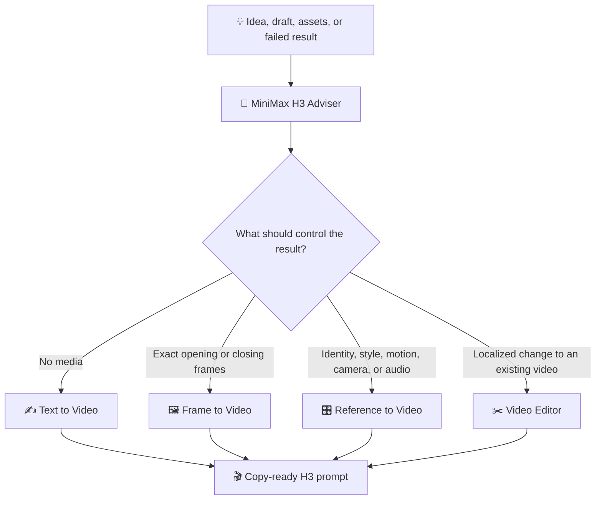

<p align="center">
  
</p>

<h1 align="center">🎬✨ MiniMax H3 Prompt Skills ✨🎬</h1>

<p align="center">
  <strong>Five reusable skills for directing, improving, and debugging MiniMax H3 video prompts.</strong><br>
  🧭 Route the idea · ✍️ Build the shot · 🖼️ Animate frames · 🎛️ Bind references · ✂️ Edit precisely
</p>

---

## 🚀 One-command installation

Install all five skills:

```bash
npx skills add chiphoton/MiniMax-H3-Prompt-Skills
```

Install globally:

```bash
npx skills add chiphoton/MiniMax-H3-Prompt-Skills --global
```

Install for Codex:

```bash
npx skills add chiphoton/MiniMax-H3-Prompt-Skills --agent codex
```

## 🌐 Open WebUI installation

[Open WebUI Skills](https://docs.openwebui.com/features/workspace/skills/) require each imported skill to be a single self-contained Markdown file:

1. Open **Workspace → Skills**.
2. Choose **Import**.
3. Import the `.md` files from [`adapter/open-webui`](adapter/open-webui).
4. Attach the skills to a model, enable them for a chat, or invoke one with `$`.

The Open WebUI editions inline all templates, examples, routing logic, and reference guidance. They do not depend on sibling files or image assets.

## 🧰 The five skills

| | Skill | Best for | What it returns |
|---:|---|---|---|
| 🧭 | [`minimax-h3-adviser`](skills/minimax-h3-adviser/SKILL.md) | Starting from an idea, uncertain asset strategy, weak draft, or failed generation | The right workflow, assumptions, settings, asset roles, a copy-ready prompt, and risk checks |
| ✍️ | [`minimax-h3-text-to-video`](skills/minimax-h3-text-to-video/SKILL.md) | Creating a complete clip from language with no controlling media | Timed action, camera, look, audio, constraints, and fal.ai settings |
| 🖼️ | [`minimax-h3-frame-to-video`](skills/minimax-h3-frame-to-video/SKILL.md) | Animating an exact opening frame or bridging exact first and last frames | A continuous motion bridge with composition and identity locks |
| 🎛️ | [`minimax-h3-reference-to-video`](skills/minimax-h3-reference-to-video/SKILL.md) | Using images, videos, or audio for identity, style, motion, camera, performance, music, or voice | An asset ledger, bounded reference assignments, timed beats, and conflict checks |
| ✂️ | [`minimax-h3-video-editor`](skills/minimax-h3-video-editor/SKILL.md) | Changing part of an existing video while preserving everything else | Change-and-preserve pairs, integration instructions, and preservation checks |

## 🗺️ How the skills relate



The adviser can be used by itself. It asks one high-impact question at a time in guided mode, or completes the prompt immediately when the user asks for fast mode.

## 💬 Usage examples

### 🧭 Let the adviser choose the workflow

```text
$minimax-h3-adviser
I have a portrait of a singer, a clip whose camera movement I like, and a vocal track.
Create a 12-second cinematic performance. Use your best judgment.
```

Expected route: **reference to video**. The portrait controls identity, the video controls only camera motion, and the audio controls vocal performance and synchronization.

### ✍️ Invent a shot entirely from text

```text
$minimax-h3-text-to-video
Create a 10-second 16:9 premium ad for a brushed-steel espresso machine.
One continuous shot, quiet pre-dawn mood, synchronized product sounds, and a stable hero ending.
```

### 🖼️ Animate an exact first frame

```text
$minimax-h3-frame-to-video
Use the uploaded exhibition poster as the exact opening frame.
Animate only the grid, sculpture, and red blocks for 8 seconds. Keep every printed word and the border locked.
```

### 🎛️ Give every reference one job

```text
$minimax-h3-reference-to-video
Image 1 defines the shoe. Image 2 defines the athlete. Image 3 supplies only the wet dawn palette.
Video 1 supplies only stride mechanics and edit rhythm. Make a 15-second vertical campaign.
```

### ✂️ Make a surgical edit

```text
$minimax-h3-video-editor
In Video 1, replace only the illuminated storefront sign with Image 1 and relight the scene for early night.
Preserve the camera path, pedestrians, traffic timing, architecture, and source audio.
```

### ⚡ Skip questions with fast mode

Add any of these phrases when you want an immediate result:

```text
Use your best judgment.
Skip the grilling.
[mode=fast]
Give prompt immediately.
```

## 🎨 Visual prompt palette

The adviser includes visual atlases for discussing creative direction without relying on vague style words.

<table>
  <tr>
    <td align="center"><strong>📐 Framing</strong><br></td>
    <td align="center"><strong>🔭 Lens feel</strong><br></td>
  </tr>
  <tr>
    <td align="center"><strong>💡 Lighting</strong><br></td>
    <td align="center"><strong>🎞️ Texture</strong><br></td>
  </tr>
  <tr>
    <td align="center"><strong>🎥 Camera motion</strong><br></td>
    <td align="center"><strong>💫 Transitions</strong><br></td>
  </tr>
</table>

The atlases are optional conversation aids. The generated MiniMax prompt remains text-only.

## 📦 Repository layout

```text
.
├── skills/                  # Native Agent Skills with references and visual assets
│   ├── minimax-h3-adviser/
│   ├── minimax-h3-text-to-video/
│   ├── minimax-h3-frame-to-video/
│   ├── minimax-h3-reference-to-video/
│   └── minimax-h3-video-editor/
├── adapter/open-webui/      # Self-contained one-file Markdown editions
└── docs/                    # README artwork
```

## 🧠 Prompting philosophy

- Give every reference one explicit job and block unrelated influence.
- Prefer two or three controllable beats over an overloaded short narrative.
- Pair each requested edit with what must stay unchanged.
- Direct sound as deliberately as picture when audio matters.
- Use a few failure-specific constraints instead of generic quality-word piles.
- Preserve detailed user choices; add creative assumptions only when the brief is sparse.

## ⚠️ Provider notes

The skills include fal.ai-oriented endpoint and capability guidance for MiniMax H3. Provider schemas can change, so verify current limits before implementing API calls or production automation. These skills produce prompts and recommendations only; they do not submit generation jobs.
