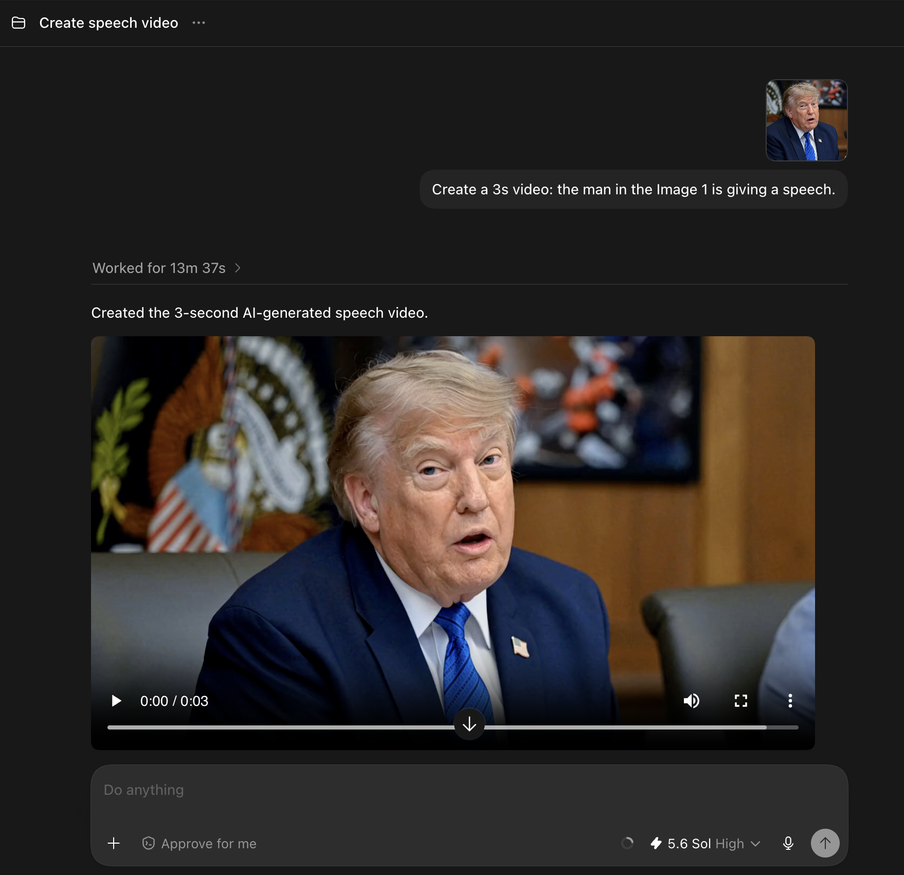
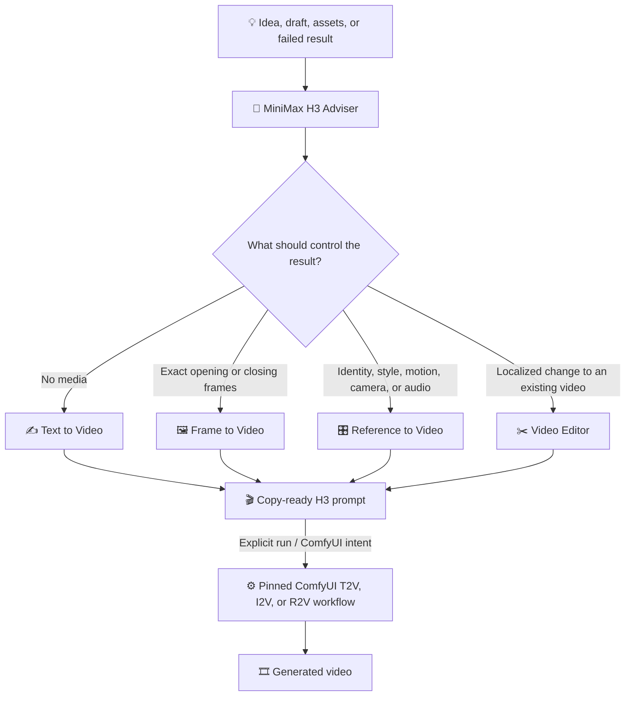
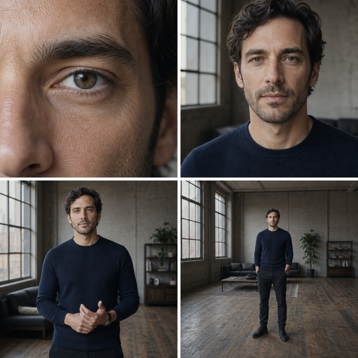
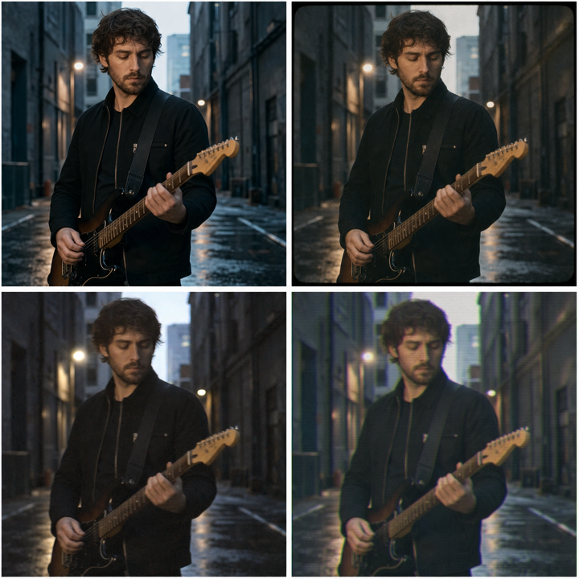
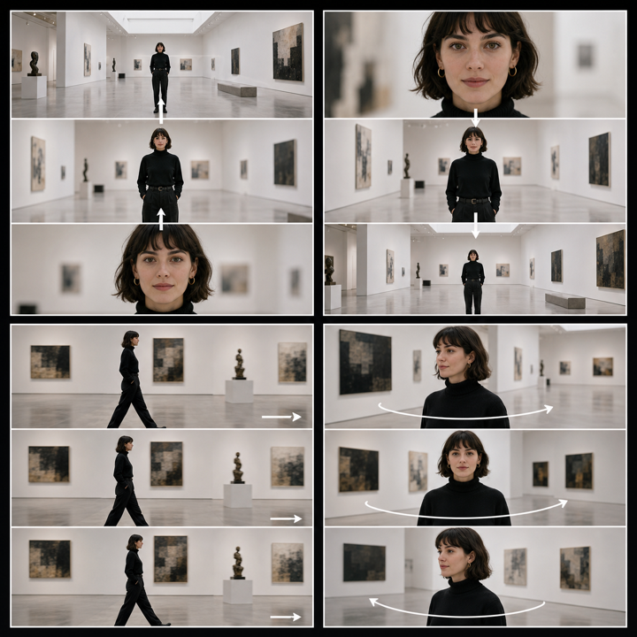

<p align="center">
  
</p>

<h1 align="center">🎬✨ MiniMax H3 Prompt Skills ✨🎬</h1>

<p align="center">
  <strong>Six reusable skills for directing, improving, debugging, and running MiniMax H3 video prompts.</strong><br>
  🧭 Route the idea · ✍️ Build the shot · 🖼️ Animate frames · 🎛️ Bind references · ✂️ Edit precisely · ⚙️ Run in ComfyUI
</p>

---

## 🤝 Create with Codex + ComfyUI

Turn a plain-language idea and optional reference media into a finished MiniMax H3 video without leaving Codex. The `minimax-h3-comfyui` skill connects the conversation to your local or self-hosted ComfyUI instance and handles the workflow from preparation through retrieval.

- **Prompt naturally:** describe the shot in ordinary language and attach images, video, or audio when they should guide the result.
- **Route automatically:** run the matching pinned official text-to-video, image-to-video, or reference-to-video workflow.
- **Execute reliably:** upload inputs, resolve installed models, patch only declared fields, validate the graph, and submit it to ComfyUI.
- **Stay in control:** preserve your prompt and official workflow defaults, opt into prompt enhancement, run headlessly, or load the prepared graph onto the live ComfyUI canvas.
- **Get the result back:** wait for Codex to monitor and return the finished video inline, or submit asynchronously and keep the `prompt_id` for later.

<p align="center">
  
</p>

## 🚀 One-command installation

Install all six skills:

```bash
npx skills add chiphoton/MiniMax-H3-Prompt-Skills
```

Install globally:

```bash
npx skills add chiphoton/MiniMax-H3-Prompt-Skills --global
```

Install for Codex:

```bash
npx skills add chiphoton/MiniMax-H3-Prompt-Skills --agent codex
```

## 🌐 Open WebUI installation

[Open WebUI Skills](https://docs.openwebui.com/features/workspace/skills/) require each imported skill to be a single self-contained Markdown file:

1. Open **Workspace → Skills**.
2. Choose **Import**.
3. Import the `.md` files from [`adapter/open-webui`](adapter/open-webui).
4. Attach the skills to a model, enable them for a chat, or invoke one with `$`.

The Open WebUI editions inline all templates, examples, routing logic, and reference guidance. They do not depend on sibling files or image assets.

## 🧰 The six skills

| | Skill | Best for | What it returns |
|---:|---|---|---|
| 🧭 | [`minimax-h3-adviser`](skills/minimax-h3-adviser/SKILL.md) | Starting from an idea, uncertain asset strategy, weak draft, or failed generation | The right workflow, assumptions, settings, asset roles, a copy-ready prompt, and risk checks |
| ✍️ | [`minimax-h3-text-to-video`](skills/minimax-h3-text-to-video/SKILL.md) | Creating a complete clip from language with no controlling media | Timed action, camera, look, audio, constraints, and fal.ai settings |
| 🖼️ | [`minimax-h3-frame-to-video`](skills/minimax-h3-frame-to-video/SKILL.md) | Animating an exact opening frame or bridging exact first and last frames | A continuous motion bridge with composition and identity locks |
| 🎛️ | [`minimax-h3-reference-to-video`](skills/minimax-h3-reference-to-video/SKILL.md) | Using images, videos, or audio for identity, style, motion, camera, performance, music, or voice | An asset ledger, bounded reference assignments, timed beats, and conflict checks |
| ✂️ | [`minimax-h3-video-editor`](skills/minimax-h3-video-editor/SKILL.md) | Changing part of an existing video while preserving everything else | Change-and-preserve pairs, integration instructions, and preservation checks |
| ⚙️ | [`minimax-h3-comfyui`](skills/minimax-h3-comfyui/SKILL.md) | Running a finished H3 prompt through local or self-hosted ComfyUI | A validated queued job, `prompt_id`, diagnostics, and the fetched video by default |

## 🗺️ How the skills relate



The adviser can be used by itself. It asks one high-impact question at a time in guided mode, or completes the prompt immediately when the user asks for fast mode. It invokes ComfyUI only when the user explicitly asks to run, submit, queue, preview, or fetch a generation.

## 💬 Usage examples

### 🧭 Let the adviser choose the workflow

```text
$minimax-h3-adviser
I have a portrait of a singer, a clip whose camera movement I like, and a vocal track.
Create a 12-second cinematic performance. Use your best judgment.
```

Expected route: **reference to video**. The portrait controls identity, the video controls only camera motion, and the audio controls vocal performance and synchronization.

### ✍️ Invent a shot entirely from text

```text
$minimax-h3-text-to-video
Create a 10-second 16:9 premium ad for a brushed-steel espresso machine.
One continuous shot, quiet pre-dawn mood, synchronized product sounds, and a stable hero ending.
```

### 🖼️ Animate an exact first frame

```text
$minimax-h3-frame-to-video
Use the uploaded exhibition poster as the exact opening frame.
Animate only the grid, sculpture, and red blocks for 8 seconds. Keep every printed word and the border locked.
```

### 🎛️ Give every reference one job

```text
$minimax-h3-reference-to-video
Image 1 defines the shoe. Image 2 defines the athlete. Image 3 supplies only the wet dawn palette.
Video 1 supplies only stride mechanics and edit rhythm. Make a 15-second vertical campaign.
```

### ✂️ Make a surgical edit

```text
$minimax-h3-video-editor
In Video 1, replace only the illuminated storefront sign with Image 1 and relight the scene for early night.
Preserve the camera path, pedestrians, traffic timing, architecture, and source audio.
```

### ⚡ Skip questions with fast mode

Add any of these phrases when you want an immediate result:

```text
Use your best judgment.
Skip the grilling.
[mode=fast]
Give prompt immediately.
```

### ⚙️ Run a finished prompt in ComfyUI

```text
$minimax-h3-comfyui
Run this prompt with the uploaded first frame. [return=true]
```

The default is to wait for completion and fetch the video. Use `[return=false]` or `[return=0]` to submit asynchronously. Prompt text is preserved unless `[prompt_enhance=true]` or `[pe=1]` is present.

Runs are headless by default: `[load_workflow=false]` does not initialize or open the Codex browser and produces no preview or canvas commentary. Use `[load_workflow=true]` only when you want the prepared workflow loaded into the live ComfyUI canvas; add `[preview=false]` to keep any required browser work in the background.

## ⚙️ ComfyUI setup

The repository is also a Codex plugin. Its [`.mcp.json`](.mcp.json) pins [`artokun/comfyui-mcp`](https://github.com/artokun/comfyui-mcp) 0.49.3 and targets `http://localhost:8188`. ComfyUI must already be running; the skill never downloads models, installs nodes, or restarts ComfyUI without explicit permission.

Configuration is optional. Settings layer from user config to project config, with project values taking precedence:

```text
~/.config/minimax-h3-comfyui/comfy-config.json
<project-root>/.config/comfy-config.json
```

Copy [`comfy-config.example.json`](skills/minimax-h3-comfyui/assets/comfy-config.example.json) when you need overrides. Empty model or generation values preserve the official workflow defaults. If `localhost:8188` is reachable, the skill continues silently; otherwise it offers retry or a config change. A custom address must also be reflected in the MCP server's `COMFYUI_URL` target.

The skill contains untouched official UI graphs and deterministic API-format derivatives for T2V, I2V, and R2V. It patches only declared semantic fields. Custom attached workflow adaptation is intentionally deferred.

## 🎨 Visual prompt palette

The adviser includes visual atlases for discussing creative direction without relying on vague style words.

<table>
  <tr>
    <td align="center"><strong>📐 Framing</strong><br></td>
    <td align="center"><strong>🔭 Lens feel</strong><br></td>
  </tr>
  <tr>
    <td align="center"><strong>💡 Lighting</strong><br></td>
    <td align="center"><strong>🎞️ Texture</strong><br></td>
  </tr>
  <tr>
    <td align="center"><strong>🎥 Camera motion</strong><br></td>
    <td align="center"><strong>💫 Transitions</strong><br></td>
  </tr>
</table>

The atlases are optional conversation aids. The generated MiniMax prompt remains text-only.

## 📦 Repository layout

```text
.
├── skills/                  # Native Agent Skills with references and visual assets
│   ├── minimax-h3-adviser/
│   ├── minimax-h3-text-to-video/
│   ├── minimax-h3-frame-to-video/
│   ├── minimax-h3-reference-to-video/
│   ├── minimax-h3-video-editor/
│   └── minimax-h3-comfyui/
├── .codex-plugin/plugin.json # Codex plugin metadata
├── .mcp.json                 # Pinned local ComfyUI MCP server
├── adapter/open-webui/      # Self-contained one-file Markdown editions
├── docs/                    # README artwork
└── outputs/                 # Local generated media (gitignored)
```

## 🧠 Prompting philosophy

- Give every reference one explicit job and block unrelated influence.
- Prefer two or three controllable beats over an overloaded short narrative.
- Pair each requested edit with what must stay unchanged.
- Direct sound as deliberately as picture when audio matters.
- Use a few failure-specific constraints instead of generic quality-word piles.
- Preserve detailed user choices; add creative assumptions only when the brief is sparse.

## ⚠️ Provider notes

The prompt specialists include fal.ai-oriented endpoint and capability guidance for MiniMax H3. Provider schemas can change, so verify current limits before implementing production automation. Only `minimax-h3-comfyui`, or the adviser on explicit execution intent, submits generation jobs.
