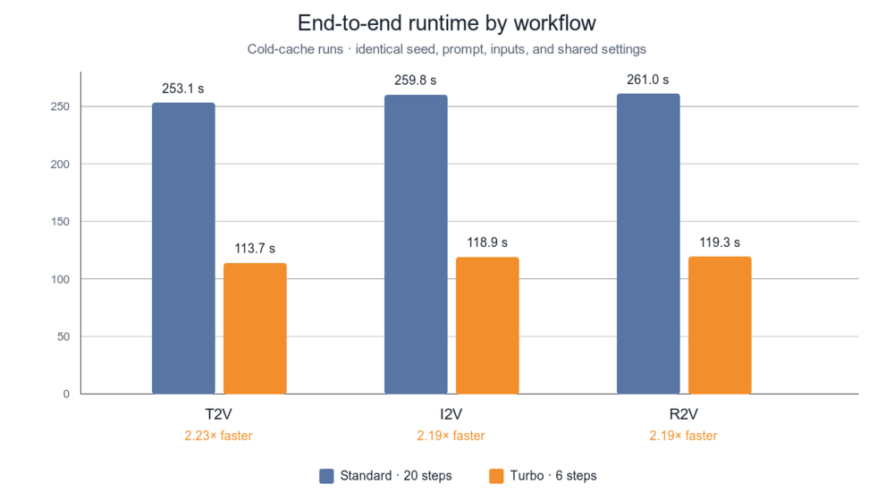
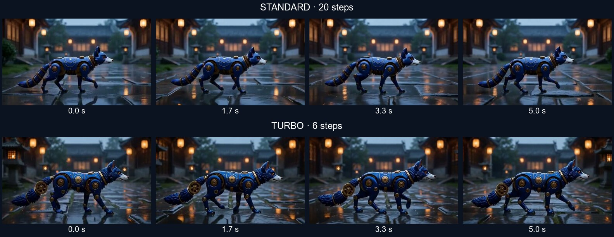
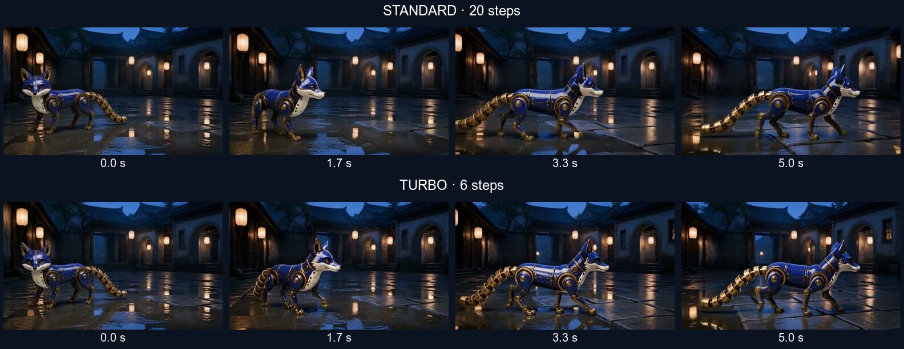
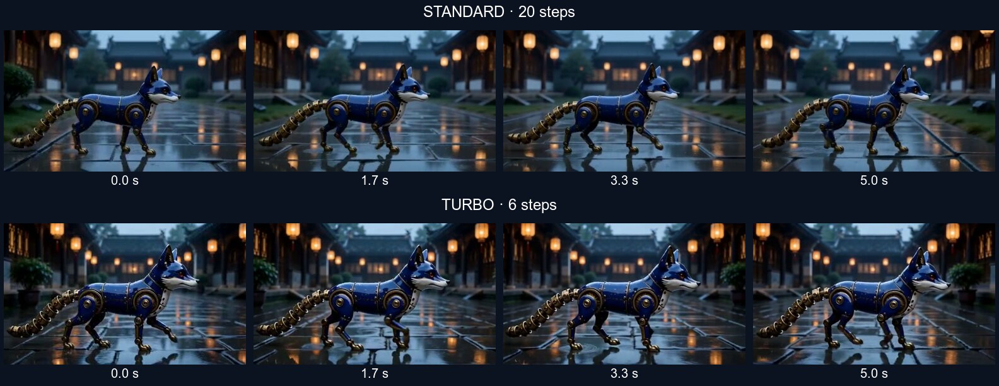

# MiniMax H3 Standard vs Turbo

Benchmark date: 2026-08-19  
Modes: text-to-video (T2V), first-frame image-to-video (I2V), and reference-to-video (R2V)

## Result

Turbo completed all three workflows in **351.8 seconds**, compared with **773.9 seconds** for Standard. That is a **2.20× end-to-end speedup** and a **54.5% wall-time reduction** across this benchmark. Every submitted graph completed successfully with no node errors.

Visual quality remained competitive in all three modes. The sampled frames show no gross identity collapse or scene loss, and an FFmpeg scene-change scan detected no hard cuts above a 0.30 threshold in any output. Turbo generally produced a sharper, higher-contrast fox with more small mechanical detail. Standard used simpler geometry and was slightly steadier in the clockwork tail and gear assembly. I2V opening-frame adherence was effectively tied: raw-output first-frame SSIM was 0.8245 for Standard and 0.8215 for Turbo.

This supports Turbo as the practical default for iteration and general generation. Standard remains useful when a conservative render with slightly less fine-detail drift is worth roughly doubling the wait.

## Controlled setup

The prompt, seed, conditioning images, resolution, duration, frame count, frame rate, scheduler, denoise value, model family, text encoder, and VAEs were held constant within each pair. Each job began from a cold model cache by unloading models and freeing memory before submission.

Turbo's LoRA and custom sampler are required parts of the supported Turbo workflow. Therefore, this is a comparison of the **Standard workflow at 20 steps** against the **Turbo workflow at 6 steps**, not a pure step-count ablation. A shared seed controls the initial noise, but different samplers and the Turbo LoRA do not produce identical stochastic trajectories.

| Setting | Value |
|---|---|
| Seed | `314159265` |
| Canvas | 768 × 448 (16:9) |
| Output | 124 frames at 24 fps; 5.167 seconds of video |
| Scheduler / denoise | `simple` / `1.0` |
| Standard | 20 steps; `res_multistep` |
| Turbo | 6 steps; `MiniMaxH3TurboSampler`; Turbo LoRA at strength 1.0 |
| FL2VA model | `minimax_h3_fl2va_int8_convrot.safetensors` |
| REF2VA model | `minimax_h3_ref2va_int8_convrot.safetensors` |
| Text encoder | `qwen3vl_32b_minimax_h3_int8_convrot.safetensors` |
| Video / audio VAE | `minimax_h3_video_vae_fp16.safetensors` / `minimax_h3_audio_vae_fp32.safetensors` |
| Runtime | ComfyUI 0.30.0; PyTorch 2.12.1+cu130; NVIDIA GB10; 128 GB unified memory |

The six exact API graphs and machine-readable measurements are in [workflows](turbo-vs-standard/workflows/) and [run-manifest.json](turbo-vs-standard/run-manifest.json).

## Runtime



| Mode | Standard total | Turbo total | End-to-end speedup | Time saved | Standard sampler | Turbo sampler | Sampler speedup |
|---|---:|---:|---:|---:|---:|---:|---:|
| T2V | 253.076 s | 113.650 s | **2.23×** | 139.426 s | 207 s | 77 s | 2.69× |
| I2V | 259.826 s | 118.852 s | **2.19×** | 140.974 s | 214 s | 82 s | 2.61× |
| R2V | 260.995 s | 119.346 s | **2.19×** | 141.649 s | 215 s | 82 s | 2.62× |
| **All runs** | **773.897 s** | **351.848 s** | **2.20×** | **422.049 s** | **636 s** | **241 s** | **2.64×** |

End-to-end timing comes from ComfyUI's `execution_start` and `execution_success` timestamps and includes cold loading, sampling, VAE decode, audio decode, and output encoding. Sampler timing is taken from the corresponding progress log.

## Inputs

Both conditioning images were generated specifically for this benchmark with OpenAI GPT Image, normalized to 768 × 448, and reused unchanged between Standard and Turbo.

| I2V literal opening frame | R2V identity reference |
|---|---|
|  |  |

The same text prompt was used for all six runs ([prompt.txt](turbo-vs-standard/prompt.txt)):

> A compact cobalt-blue enamel clockwork fox with a white ceramic muzzle, amber glass eyes, brass joints, and a segmented gear-tail walks steadily from left to right across a rain-slick stone courtyard at blue hour. Its four articulated legs move in a natural alternating gait; the tail gears rotate smoothly and its ears twitch once. The camera makes a slow lateral tracking move, keeping the fox centered. Warm paper lanterns sway gently; raindrops stipple puddles and reflections ripple under its paws. Preserve the fox's exact body geometry, colors, and materials throughout. Cinematic photorealism, stable exposure, continuous single shot, no cuts, no text. Audio: soft steady rain, delicate synchronized brass mechanism clicks, quiet wet footsteps, distant nighttime courtyard ambience; no speech, no music.

## T2V comparison



| Observation | Standard, 20 steps | Turbo, 6 steps |
|---|---|---|
| Subject | Clean, readable blue-and-brass fox with comparatively simple panels | Sharper and more intricate panels, gears, and surface detail |
| Stability in sampled frames | Body proportions and tail structure remain comparatively steady | Body remains coherent; tail and exposed gear detail vary slightly more |
| Scene and action | Rainy lantern courtyard and left-to-right walking are maintained | Same scene and action are maintained with stronger local contrast |

The main Turbo trade-off in this benchmark appears here: fine mechanical detail looks richer, but the tail/gear assembly is less conservative from frame to frame.

Videos: [Standard MP4](turbo-vs-standard/videos/t2v-standard.mp4) · [Turbo MP4](turbo-vs-standard/videos/t2v-turbo.mp4)

## I2V comparison



| Observation | Standard, 20 steps | Turbo, 6 steps |
|---|---|---|
| Opening-frame adherence | SSIM 0.8245 against the source frame | SSIM 0.8215 against the source frame |
| Identity | Preserves blue enamel, white muzzle/chest, brass legs, and segmented tail | Preserves the same major identity features with crisper panel separation |
| Scene | Retains the source courtyard, lantern layout, and wet paving | Retains the same scene and composition |

The SSIM difference is 0.0030 on the raw first frames, which is too small to indicate a material adherence loss in this single run. Both outputs then evolve away from the literal opening frame as the fox begins walking, as intended.

Videos: [Standard MP4](turbo-vs-standard/videos/i2v-standard.mp4) · [Turbo MP4](turbo-vs-standard/videos/i2v-turbo.mp4)

## R2V comparison



| Observation | Standard, 20 steps | Turbo, 6 steps |
|---|---|---|
| Reference transfer | Carries over the blue shell, white muzzle, amber eye, brass joints, and long segmented tail | Carries over the same identity cues with stronger highlights and more visible small parts |
| Stability in sampled frames | Consistent silhouette and simplified mechanical construction | Consistent silhouette; slightly more part-level variation but no gross identity break |
| Environment | Correctly invents the requested courtyard around a studio reference | Correctly invents the same requested environment with higher local contrast |

Videos: [Standard MP4](turbo-vs-standard/videos/r2v-standard.mp4) · [Turbo MP4](turbo-vs-standard/videos/r2v-turbo.mp4)

## Encoded deliverables and audio measurements

The checked-in videos are documentation copies encoded as H.264 CRF 28 (`medium`, `yuv420p`) with AAC audio and fast-start metadata. All contain 124 video frames at 768 × 448 and 24 fps, plus stereo 32 kHz audio.

| Mode | Variant | Raw output | Docs MP4 | Docs bitrate | Integrated loudness | True peak |
|---|---|---:|---:|---:|---:|---:|
| T2V | Standard | 758 kB | 379 kB | 585 kb/s | -22.1 LUFS | -7.2 dBFS |
| T2V | Turbo | 993 kB | 491 kB | 757 kb/s | -17.8 LUFS | -5.8 dBFS |
| I2V | Standard | 795 kB | 392 kB | 606 kb/s | -32.8 LUFS | -9.1 dBFS |
| I2V | Turbo | 1,037 kB | 498 kB | 769 kb/s | -31.1 LUFS | -7.8 dBFS |
| R2V | Standard | 770 kB | 371 kB | 572 kb/s | -33.7 LUFS | -8.7 dBFS |
| R2V | Turbo | 1,035 kB | 510 kB | 787 kb/s | -31.1 LUFS | -7.5 dBFS |

At the same documentation encode settings, the Turbo files receive more bits in all three modes, consistent with their greater fine-detail and local-contrast complexity; file size alone is not a quality score. Turbo audio is 1.7–4.3 LU louder in these samples. None of the six outputs approach digital clipping, but downstream mixes should still normalize loudness rather than assume Standard and Turbo will match.

## Interpretation

| Question | Finding |
|---|---|
| Is Turbo materially faster? | Yes. Every mode is at least 2.18× faster end-to-end in this benchmark. |
| Does Turbo preserve image conditioning? | Yes in this run. I2V first-frame SSIM is nearly tied, and R2V retains all major identity cues in the sampled frames. |
| Is Turbo visually identical to Standard? | No. Turbo is sharper and more detailed, while Standard is simpler and slightly more conservative in small mechanical geometry. |
| Is Turbo a reasonable default? | Yes for iteration and most generations, with Standard retained as an opt-out for users prioritizing conservative fine-detail stability. |
| Does the benchmark isolate only step count? | No. The required Turbo LoRA and custom sampler are part of the treatment, so the result compares complete supported workflows. |

## Reproduction details

The Turbo nodes and LoRA used here correspond to [ComfyUI-MiniMax-H3-Turbo](https://github.com/Larryvrh/ComfyUI-MiniMax-H3-Turbo) and the [MiniMax-H3 Turbo LoRA](https://huggingface.co/larryvrh/MiniMax-H3-Turbo-Lora). The run graphs pin every model and user-visible setting used by this machine.

<details>
<summary>GPT Image prompt for the R2V identity reference</summary>

```text
Use case: stylized-concept
Asset type: MiniMax H3 reference-to-video identity input
Primary request: create a clean identity reference image of one compact clockwork fox
Scene/backdrop: seamless warm-gray studio backdrop with a soft floor shadow
Subject: a small cobalt-blue enamel clockwork fox, full body visible in a clear three-quarter side view; white ceramic muzzle and chest plate; two amber glass eyes; symmetrical triangular blue ears with brass inner hinges; four slim articulated legs with exposed brass joints; one distinctive segmented brass gear-tail curling gently behind it
Style/medium: highly detailed cinematic product photography with believable physical materials, not an illustration
Composition/framing: 16:9 landscape, eye-level, fox centered with generous margins, every paw and the complete tail visible
Lighting/mood: soft neutral studio lighting with crisp readable material separation
Materials/textures: glossy cobalt enamel with tiny natural wear, brushed brass gears and hinges, smooth white ceramic, amber glass
Constraints: exactly one fox; internally consistent mechanical construction; no motion blur; no text; no labels; no logos; no watermark
Avoid: extra limbs, duplicate tails, cropped paws, costume, scenery, people
```

</details>

<details>
<summary>GPT Image prompt for the I2V opening frame</summary>

The R2V identity image above was supplied as Image 1.

```text
Use case: identity-preserve
Asset type: MiniMax H3 image-to-video literal opening frame
Input images: Image 1 is the identity reference for the clockwork fox
Primary request: place the exact same clockwork fox from Image 1 at the beginning of a cinematic rainy-courtyard shot
Scene/backdrop: rain-slick old stone courtyard at blue hour, warm paper lanterns in the middle distance, shallow puddles with clean reflections, subtle mist
Subject: preserve the fox's exact cobalt-blue enamel body panels, white ceramic muzzle and chest, amber glass eyes, brass joints, four articulated legs, triangular ears, proportions, wear marks, and distinctive segmented brass gear-tail
Style/medium: photorealistic cinematic frame with believable physical materials
Composition/framing: 16:9 landscape, low eye-level wide shot; full fox visible on the left third facing toward the right with open walking space ahead; complete tail and every paw inside frame
Lighting/mood: cool blue ambient light balanced by warm lantern glow; readable silhouette
Constraints: still opening frame before motion begins; sharp subject; no motion blur; one fox only; preserve identity exactly; no people; no text; no logos; no watermark
Avoid: redesigning the fox, extra limbs, duplicate tail, cropped paws, rain obscuring the subject
```

</details>

## Limitations

- This is a controlled single-seed comparison, not a distribution over many prompts or seeds.
- Visual findings come from matched frames extracted at 0.0, 1.7, 3.3, and 5.0 seconds, supplemented by an automated hard-cut scan; they are not a frame-by-frame motion audit or blinded human-preference study.
- SSIM is appropriate for the literal I2V opening frame but not for R2V, where the reference has a different background and composition.
- Loudness and bitrate are objective technical measurements, not measures of semantic audio correctness or perceptual video quality.
- Generated intermediate frame files were removed after the final contact sheets were assembled; they can be regenerated losslessly from the included videos at the documented frame indices.
