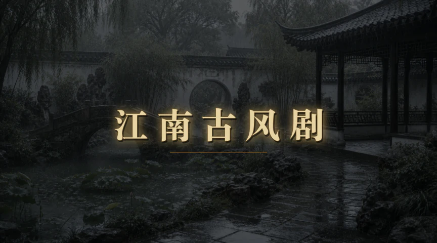
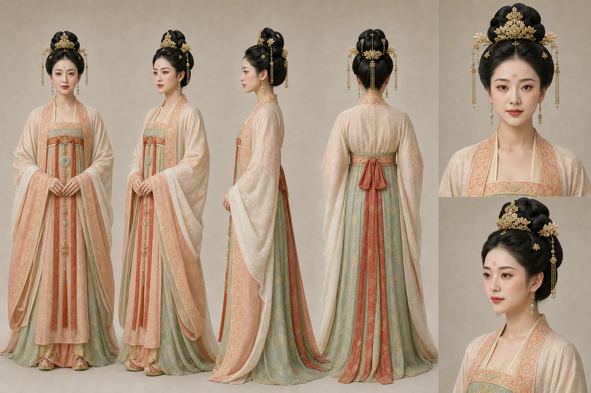
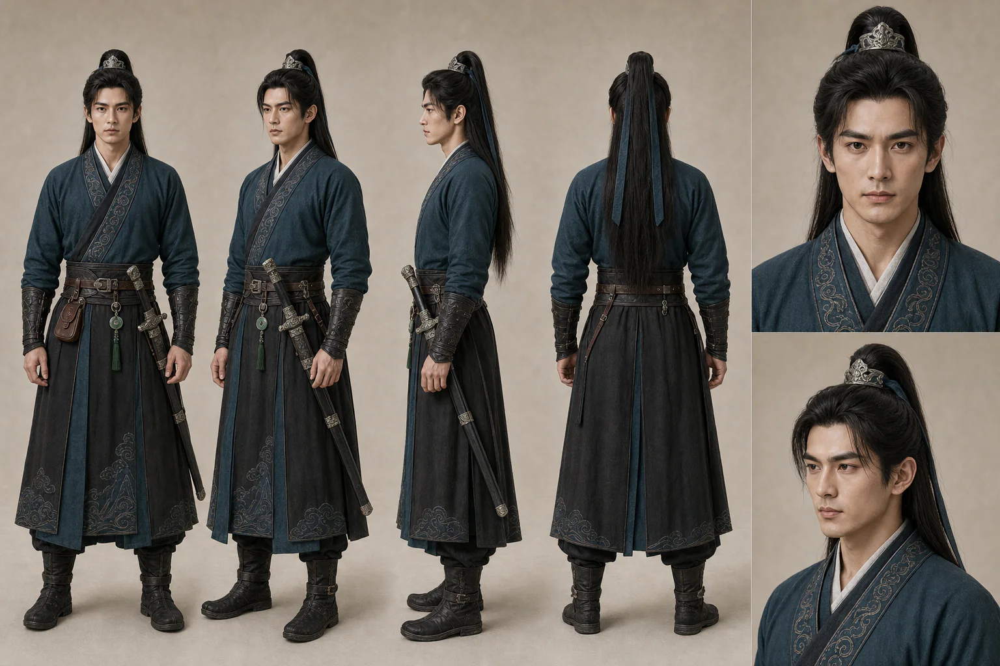
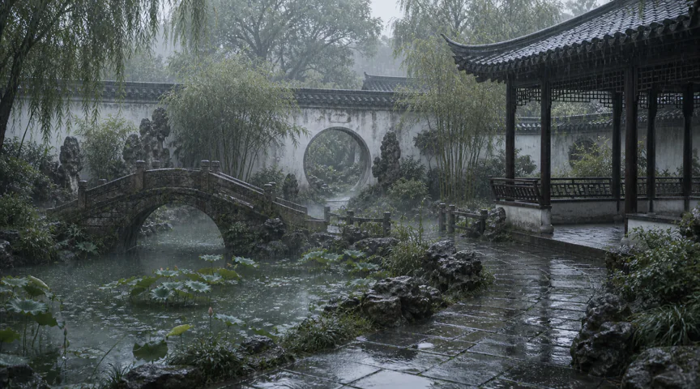
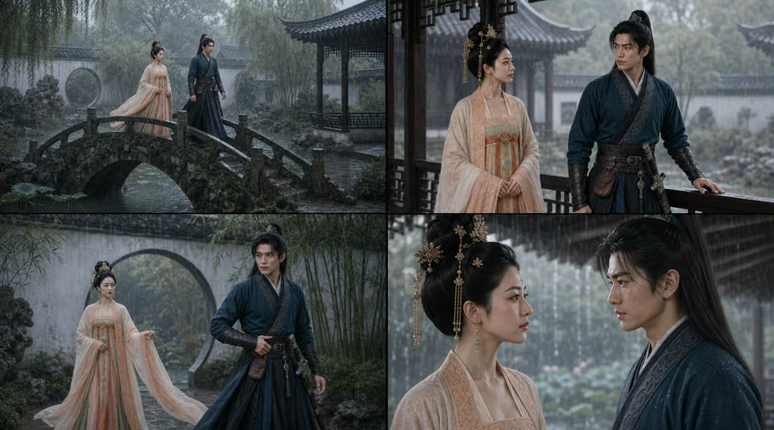

  <a href="../README.md">🎬 Example Gallery</a> ·
  <a href="README_zh.md">🌐 简体中文</a>

<h1 align="center">🌧️ Jiangnan Ancient-Style Drama</h1>

<strong>A dialogue-free cinematic encounter in a misty Jiangnan garden.</strong>

   
  <a href="final.mp4"><strong>▶️ Watch the compressed final video</strong></a>

| ⏱️ Duration | 📐 Format | 🎬 Mode | 🎚️ Profile | 🗣️ Language |
|---|---|---|---|---|
| 10 seconds | 9:5 · 864×480 · 24 fps | Guided | `commercial-ad` with project overrides | Chinese title · no dialogue or captions |

## 💬 Production conversation

<table>
  <tr>
    <td width="88" align="center" valign="top"><strong>👤 User</strong></td>
    <td valign="top">
      <strong>Normalized prompt</strong>
      
Create an approximately 10-second, landscape cinematic montage using the two provided Tang-inspired character sheets and the supplied Jiangnan visual references. Preserve both characters' identities, wardrobe, ornaments, jade accessories, and the swordsman's single sheathed sword. Place them in one coherent rain-soaked Jiangnan garden, use action only with no dialogue, add original guzheng music, and open with the exact Chinese title “江南古风剧”.

    </td>
  </tr>
</table>

<table>
  <tr>
    <td width="88" align="center" valign="top"><strong>🧠 Agent</strong></td>
    <td valign="top">
      <strong>Drama plan</strong>
      
Shape the film as a five-beat visual miniature:

      <ol>
        <li><strong>Title cover:</strong> rain, mist, moon gate, and the exact Chinese title.</li>
        <li><strong>Bridge walk:</strong> introduce both figures moving left to right.</li>
        <li><strong>Corridor glance:</strong> create a restrained relationship beat without speech.</li>
        <li><strong>Protective gust:</strong> let wind, cloth, and a hand near the sheathed sword provide the kinetic peak.</li>
        <li><strong>Final gaze:</strong> settle under the eaves on a quiet two-shot.</li>
      </ol>
      
Keep one rainy late-afternoon location, cut on guzheng accents, and reserve one clear action for each generated shot.

    </td>
  </tr>
</table>

<table>
  <tr>
    <td width="88" align="center" valign="top"><strong>🎭 Agent</strong></td>
    <td valign="top">
      <strong>Entity sheet generation</strong>
      
The two provided entity sheets were already suitable as canonical visual sources, so they were reused unchanged rather than regenerated. The woman’s face, Tang coiffure, gold buyao crown, peach-and-ivory layers, and jade were locked. The man’s face, silver guan, ink-blue wardrobe, jade, and single sheathed jian were locked independently.

    </td>
  </tr>
</table>

<table>
  <tr>
    <td width="50%" align="center"> <em>👑 Canonical female identity, hair, jewelry, and wardrobe</em></td>
    <td width="50%" align="center"> <em>⚔️ Canonical male identity, wardrobe, jade, and sheathed sword</em></td>
  </tr>
</table>

<table>
  <tr>
    <td width="88" align="center" valign="top"><strong>🏙️ Agent</strong></td>
    <td valign="top">
      <strong>Scene generation</strong>
      
Build one coherent garden that can support every shot: a mossy stone bridge, lotus pond, moon gate, white walls, dark wooden corridor, wet flagstones, bamboo, and willow. Fine rain, thin mist, cool silver-gray light, and a clear left-to-right axis keep the location continuous while leaving distinct spaces for each action.

    </td>
  </tr>
</table>

   
  <em>🌧️ Scene master locking architecture, weather, light, and screen direction</em>

<table>
  <tr>
    <td width="88" align="center" valign="top"><strong>🧩 Agent</strong></td>
    <td valign="top">
      <strong>Storyboard generation</strong>
      
Translate the four character beats into a single 2×2 visual plan: a wide bridge walk, a waist-up corridor glance, a low-angle protective pose at the moon gate, and an intimate final two-shot. The board locks character placement, lens progression, eyelines, weather, and the woman-left/man-right screen relationship before animation.

    </td>
  </tr>
</table>

   
  <em>🎥 Four-shot progression from introduction to poetic resolution</em>

<table>
  <tr>
    <td width="88" align="center" valign="top"><strong>🎞️ Agent</strong></td>
    <td valign="top">
      <strong>Video output</strong>
      
Animate four first-frame-led shots, select one valid take for each, and assemble them after a deterministic 1.4-second title cover. Clean cuts follow an original pentatonic guzheng cue, supported by restrained rain, wind, cloth, and ornament sound. The final master contains no dialogue or captions and passed both technical and visual QC.

      
<a href="final.mp4"><strong>▶️ Play the 10-second final master</strong></a>

    </td>
  </tr>
</table>

## 📦 Selected output

- 🎭 [Tang-inspired woman entity sheet](entity/tang-beauty-entity-sheet.webp)
- ⚔️ [Tang-inspired swordsman entity sheet](entity/tang-male-swordsman-entity-sheet.webp)
- 🏙️ [Rainy Jiangnan garden scene](scene/jiangnan-garden-scene.webp)
- 🧩 [Four-panel storyboard](storyboard/jiangnan-storyboard.webp)
- 🎞️ [Compressed final video](final.mp4)
