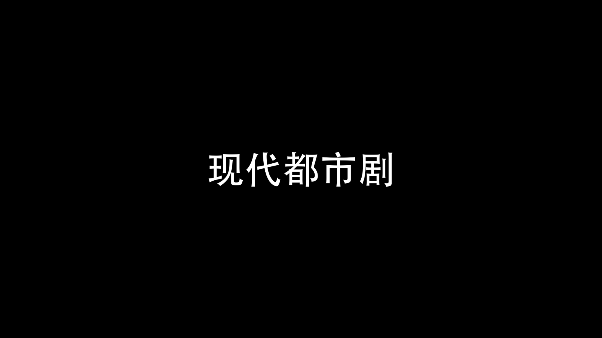
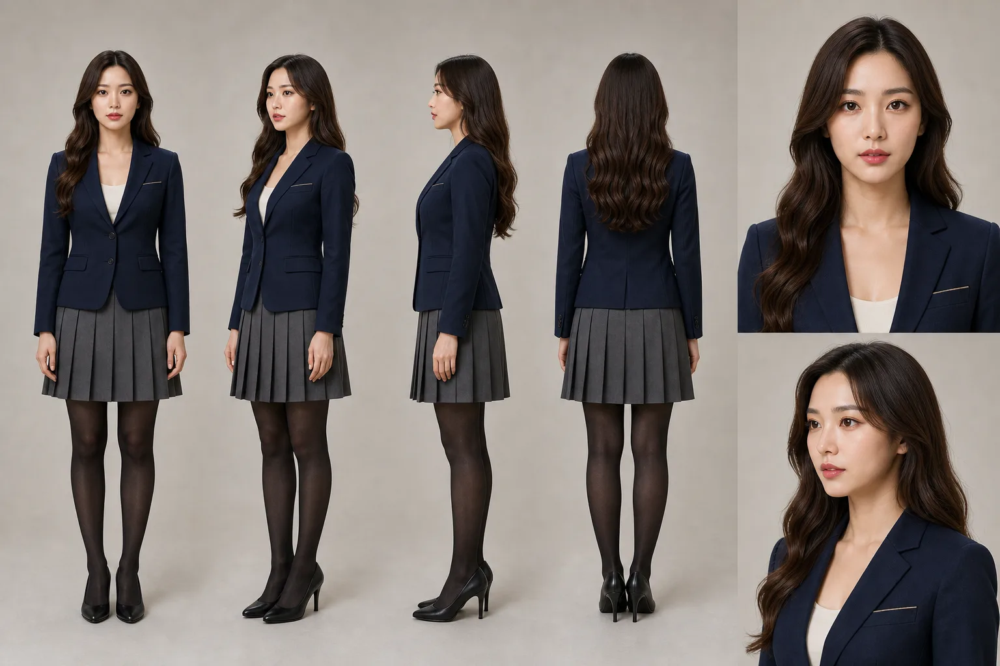
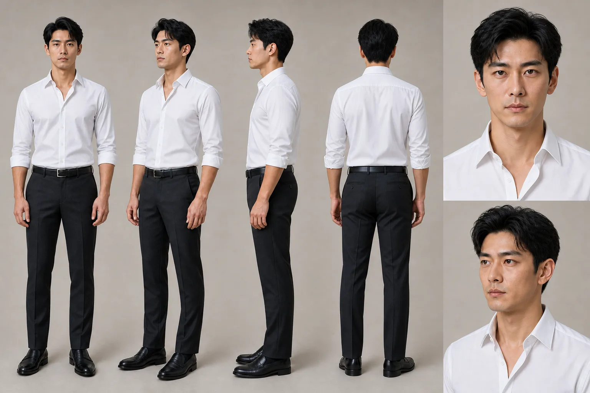
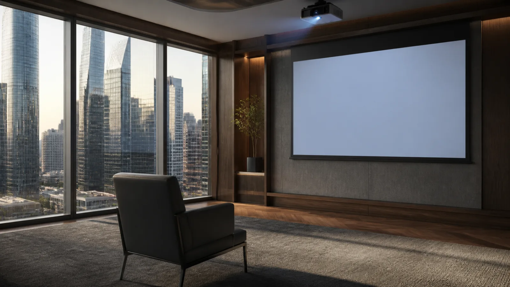
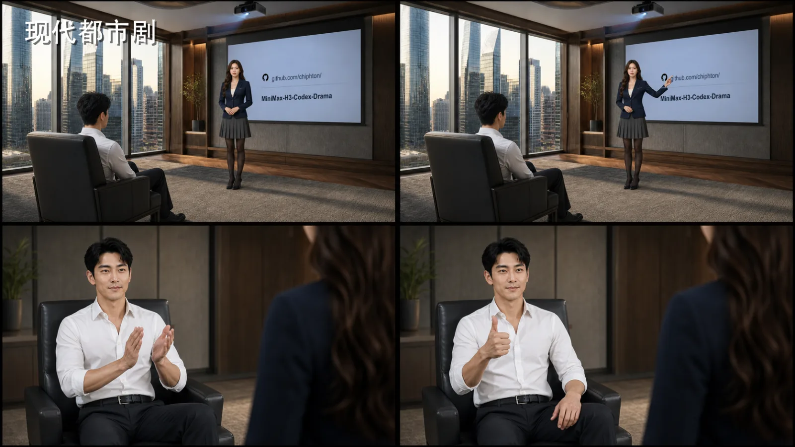

  <a href="../README_zh.md">🎬 示例画廊</a> ·
  <a href="README.md">🌐 English</a>

<h1 align="center">🏙️ 现代都市剧</h1>

<strong>一场围绕高层办公室投影汇报展开的静音职场互动。</strong>

   
  <a href="final.mp4"><strong>▶️ 观看压缩版最终视频</strong></a>

| ⏱️ 时长 | 📐 规格 | 🎬 模式 | 🎚️ Profile | 🗣️ 语言 |
|---|---|---|---|---|
| 7.5 秒 | 16:9 · 1920×1080 · 24 fps | Guided | 带项目覆盖的 `commercial-ad` | 中文片名与投影仓库文字 · 无对白、无字幕、无音频 |

## 💬 制作对话

<table>
  <tr>
    <td width="88" align="center" valign="top"><strong>👤 用户</strong></td>
    <td valign="top">
      <strong>标准化需求</strong>
      
使用提供的两张人物设定图作为唯一身份与服装基准，制作一支约 6 秒、16:9 的电影感职场微短片。两人始终位于同一座繁荣城市的高层办公室，使用大型投影幕布，不出现电脑显示器。第一组镜头让女秘书正对镜头汇报并指向指定的 GitHub 仓库，男老板坐着面向投影；随后反打至男老板正面，让他先鼓掌、再竖起大拇指。全片恰好使用两组由首尾帧控制的连续镜头；准确中文片名“现代都市剧”只能出现在独立片头，并且不使用对白、旁白或字幕。

    </td>
  </tr>
</table>

<table>
  <tr>
    <td width="88" align="center" valign="top"><strong>🧠 Agent</strong></td>
    <td valign="top">
      <strong>剧情规划</strong>
      
把短片组织为三个简洁节拍：

      <ol>
        <li><strong>片名开场：</strong>让准确中文片名与所有人物画面完全分离。</li>
        <li><strong>投影汇报：</strong>秘书正对镜头，老板以侧身或背影入画，并让仓库信息在指向动作中保持可读。</li>
        <li><strong>反打肯定：</strong>以老板为画面中心，严格完成先鼓掌、后单手竖拇指的动作顺序。</li>
      </ol>
      
全片保持蓝金色办公室基调，通过硬切延续空间关系，并避免说话口型及没有依据的产品宣称。

    </td>
  </tr>
</table>

<table>
  <tr>
    <td width="88" align="center" valign="top"><strong>🎭 Agent</strong></td>
    <td valign="top">
      <strong>人物设定图生成</strong>
      
提供的两张人物设定图已经是权威身份与服装基准，因此直接原样复用，没有重新生成。Vera Lin 锁定长卷深棕发、深蓝西装外套、浅色内搭、灰色百褶裙、黑色连裤袜与黑色高跟鞋；Adrian Cho 则锁定短黑发、白衬衫、黑色西裤与黑皮鞋。

    </td>
  </tr>
</table>

<table>
  <tr>
    <td width="50%" align="center"> <em>👩‍💼 女秘书身份、发型与汇报服装视觉基准</em></td>
    <td width="50%" align="center"> <em>👔 男老板身份、发型与办公室服装视觉基准</em></td>
  </tr>
</table>

<table>
  <tr>
    <td width="88" align="center" valign="top"><strong>🏙️ Agent</strong></td>
    <td valign="top">
      <strong>场景生成</strong>
      
构建一处高级写字楼投影汇报区：落地窗外是密集的玻璃幕墙高楼，室内使用暖色胡桃木墙板、大型壁挂幕布、天花投影仪与一把行政椅。空白幕布为后期确定性合成仓库文字提供可追踪平面，构图则明确排除台式电脑和笔记本电脑。

    </td>
  </tr>
</table>

   
  <em>🌇 锁定建筑、投影平面、日光与蓝金色调的场景基准</em>

<table>
  <tr>
    <td width="88" align="center" valign="top"><strong>🧩 Agent</strong></td>
    <td valign="top">
      <strong>故事板生成</strong>
      
把两组连续镜头映射到一张 2×2 故事板：A、B 格建立正面汇报与指向停留，C、D 格反打至坐姿老板，依次呈现鼓掌和最终竖拇指。动画前，故事板统一锁定人物身份、服装、画面方向、准确投影位置与动作顺序。

    </td>
  </tr>
</table>

   
  <em>🎥 从汇报到肯定的两组首尾帧推进</em>

<table>
  <tr>
    <td width="88" align="center" valign="top"><strong>🎞️ Agent</strong></td>
    <td valign="top">
      <strong>视频输出</strong>
      
以首尾帧方式生成两组连续镜头，保留有效的汇报与肯定版本，再接到 2.125 秒确定性黑底片名开场之后。最终修订中，片名在汇报开始前完全淡出，两组人物镜头均不再出现片名，同时移除音频流以满足全程静音要求。7.5 秒 H.264 成片通过技术与视觉质检。

      
<a href="final.mp4"><strong>▶️ 播放 7.5 秒最终成片</strong></a>

    </td>
  </tr>
</table>

## 📦 精选输出

- 👩‍💼 [Vera Lin 人物设定图](entity/vera-lin-entity-sheet.webp)
- 👔 [Adrian Cho 人物设定图](entity/adrian-cho-entity-sheet.webp)
- 🏙️ [城市高层投影办公室场景](scene/highrise-projection-office-scene.webp)
- 🧩 [两组镜头故事板](storyboard/two-shot-pairs-storyboard.webp)
- 🎞️ [压缩版最终视频](final.mp4)
