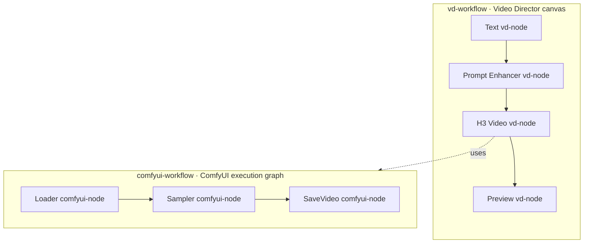

# Video Director terminology

[简体中文](TERMINOLOGY_zh.md) · [README](../README.md) · [Developer guide](../skills/canvas-adviser/references/usage.md)

This is the shared vocabulary for documentation, design discussions, agent instructions, and new UI copy. `vd-` means Video Director; `comfyui-` identifies the ComfyUI layer. Use the lowercase, hyphenated spelling in both English and Chinese, with English plurals such as `vd-nodes`.

## The two graph layers

| Term | Meaning |
|---|---|
| **vd-node** | One instance on the Video Director canvas, including inputs, generation, utilities, Preview, and Save Output. A ComfyUI-backed vd-node is still a vd-node. |
| **comfyui-node** | One node inside a ComfyUI graph. In API format it has a graph-local ID, `class_type`, and `inputs`. Both built-in and custom ComfyUI classes create comfyui-nodes. |
| **vd-workflow** | The Video Director orchestration graph of vd-nodes and their connections. **vd-graph** is its structural synonym; **canvas** means the editor view of that graph. Use vd-workflow as the default name for the overall production flow. |
| **comfyui-workflow** | A graph for ComfyUI, used as the implementation of a ComfyUI-backed vd-node. Specify **API-format comfyui-workflow** for the executable graph and **ComfyUI editor template** for UI JSON containing layout, `nodes`, and `links`. |
| **registered comfyui-workflow** | A named entry in Video Director's **ComfyUI workflow registry**, selected through `workflowId`. It combines an API graph with defaults, bindings, and exposed parameters. It is distinct from the vd-workflow containing the selecting vd-node. |

A vd-workflow can contain several ComfyUI-backed vd-nodes, each using a comfyui-workflow with many comfyui-nodes. Other vd-nodes can use Ollama, OpenAI-compatible APIs, Codex Plan, or local behavior.

“Workflow node” is ambiguous: use **generation vd-node**, a specific title such as **H3 Video vd-node**, or **ComfyUI-backed vd-node**. In particular, do not shorten “ComfyUI-backed vd-node” to “comfyui-node.”

## Definitions, packages, and wiring

| Term | Meaning |
|---|---|
| **vd-node definition** | A reusable declaration identified by type and exact version, with a content digest. A vd-node instance holds its own ID, values, and connections; several instances can use the same definition. |
| **vd-node pack** | A portable declarative `video-director.node/v1` document containing a manifest and implementation. This is the format historically called “Video Director Custom Node v1.” |
| **ComfyUI custom-node package** | An extension installed into the ComfyUI server that supplies executable Python node classes. Use **custom comfyui-node** for an instance of one of those classes. A vd-node pack does not install that Python extension. |
| **comfyui-node class** | A ComfyUI implementation class such as `KSampler`, identified by `class_type`. The class name is distinct from a graph-local comfyui-node ID. |
| **vd-port / vd-edge** | A typed connection point on a vd-node / a connection between vd-nodes. A **handle** is the canvas control representing a port. |
| **network port** | The TCP port in a provider address such as `127.0.0.1:8188`; it is unrelated to graph ports or handles. |
| **comfyui-input / comfyui-output slot / comfyui-link** | An input, indexed output, or internal connection in a comfyui-workflow. An API graph link such as `["12", 0]` refers to a comfyui-node ID and output slot. |
| **vd-field / workflow parameter** | A configurable vd-node value. “Workflow parameter” specifically means a control exposed by a registered comfyui-workflow. A field becomes a vd-port only when parameter-input mode is enabled; `field:<fieldId>` is the dynamic port ID. |
| **workflow binding** | A mapping from a vd-field, vd-port, runtime value, or literal to an exact comfyui-node input. This crosses the graph-layer boundary; it is distinct from a vd-edge or comfyui-link. |

The repository's [`custom_nodes/`](../custom_nodes/README.md) directory contains Video Director JSON documents. Its `*.node.json` files are built-in/legacy workflow documents with `nodeData`; the `*.manifest.json` example is a v1 vd-node pack. The directory is distinct from a ComfyUI installation's `custom_nodes/` directory for Python extensions. Always qualify the owner when discussing either path.

## Execution and other overlapping terms

| Use these terms | Distinction |
|---|---|
| **vd-run / vd-job / ComfyUI submission** | A vd-run orchestrates a selected scope of the vd-workflow, including batch repetitions. A vd-job is one Host-managed vd-node execution record. A ComfyUI submission is the provider-side execution tracked by `prompt_id`; only jobs using ComfyUI have that identifier. Local input/preview handling does not imply a remote job or submission. |
| **vd-job queue / ComfyUI queue** | The Video Director job scheduler's pending work versus ComfyUI's server queue. Cancellation and diagnostics must identify which queue is meant. |
| **vd-batch / ComfyUI batch parameter** | Repeated execution of a vd-run's scope versus a graph's own image/latent batch setting. They are independent counts. |
| **vd-run scheduler / sampling scheduler** | Dependency ordering of vd-jobs versus the sampler/noise schedule inside a generation graph. The `scheduler` generation parameter refers to the latter. |
| **generation prompt / system prompt / ComfyUI prompt payload** | Creative text, model instructions, and the submitted ComfyUI API graph respectively. ComfyUI's `/prompt` endpoint and `prompt_id` do not denote the user's prompt text. |
| **vd-provider / Canvas chat provider / transport** | The configured backend used by a vd-node, the provider selected for the conversation, and an internal communication route such as REST or MCP. ComfyUI is one logical vd-provider even when the Host has multiple transport adapters. |
| **model ID or model filename / workflow ID** | A provider model selection or loader weight filename versus a registered comfyui-workflow selection. A workflow can load several models; its ID is not a model ID. |
| **vd-project / Canvas session** | The Video Project containing the canvas graph, settings, job records, and asset references versus the bound conversation identified by `sessionId`. Rebinding the session does not create a new vd-project. |
| **Canvas server / ComfyUI server / host machine** | The local Node.js process running this plugin's server logic, the ComfyUI service, and the computer running either service. “vd-node host” denotes the `DirectorNodeHost` interface within the Canvas server. |
| **vd-asset / provider output** | Immutable project-owned media versus a file or result returned by a provider before import. Text results are not necessarily assets. **Project Save** persists canvas edits; the **Save Output vd-node** names an output and offers a browser download. |

## Source naming

Use `Vd*` / `vd*` for Video Director concepts and `ComfyWorkflow*` / `comfyWorkflow*` for ComfyUI graphs and registry entries. Existing `DirectorNode`, `DirectorGraph`, and `DirectorJob` names already identify the Video Director layer and remain valid. Qualify names at module and graph boundaries; local variables in a clearly scoped function can stay short.

| Concept | Preferred source names | Compatibility aliases |
|---|---|---|
| ComfyUI registry | `ComfyWorkflowStore`, `extractComfyWorkflowInterface` | `WorkflowStore`, `extractWorkflowInterface` |
| ComfyUI graph controls | `ComfyWorkflowKind`, `ComfyWorkflowBinding`, `ComfyWorkflowParameter`, `ComfyWorkflowDescriptor` | Corresponding `Workflow*` names |
| vd-node declarations | `VdNodeRegistry`, `normalizeVdNodePack`, `VD_NODE_PROTOCOL` | `NodeRegistry`, `normalizeNodePack`, `NODE_PROTOCOL` |
| vd-node interface | `VdNodeDefinitionDescriptor`, `VdPortDescriptor`, `VdFieldDescriptor` | `NodeDefinitionDescriptor`, `NodePortDescriptor`, `NodeFieldDescriptor` |
| vd-run | `VdRun`, `VdRunMode`, `VdRunPlan`, `planVdRun` | `DirectorWorkflowRun`, `WorkflowRunMode`, `WorkflowRunPlan`, `planWorkflowRun` |
| vd-node execution | `VdNodeResult`, `isExecutableVdNodeKind` | `WorkflowResult`, `isExecutableWorkflowKind` |
| Canvas execution methods | `runVdWorkflow`, `cancelVdRun` | `runWorkflow`, `cancelWorkflowRun` |

New internal call sites use the preferred names; previous exports remain as deprecated aliases for existing consumers. The historical filenames also stay stable: [`workflow-store.js`](../src/workflow-store.js) owns the ComfyUI registry, [`node-registry.js`](../src/node-registry.js) owns vd-node definitions, and [`workflow-runner.ts`](../src/client/workflow-runner.ts) plans vd-runs. The shared [types](../src/client/types.ts) document the scope of ambiguous serialized fields.

## Existing identifiers and UI labels

Keep protocol strings, RPC endpoints, filenames, external class names, serialized keys, and saved IDs exact. A source-symbol rename does not rename `workflowId`, `workflowRunId`, `nodeId`, `video-director.node/v1`, or the persisted renderer key `director`.

**Node.js** and the `node` CLI name the JavaScript runtime, not a graph element; retain their external names too.

| Existing spelling | Read it as |
|---|---|
| `DirectorNode`, `project.graph.nodes[].id`, job `nodeId` | vd-node instance / instance ID |
| `nodeType`, `nodeVersion`, `nodeDigest`, `NodeRegistry` | vd-node definition identity / registry |
| `DirectorGraph`, `project.graph` | vd-workflow / vd-graph |
| `WorkflowStore`, `WorkflowDescriptor`, `workflowId`, `workflows.json` | ComfyUI workflow registry or an entry in it |
| `nodeData.workflow`, `implementation.workflow`, `comfyui.workflow` | Embedded comfyui-workflow or its implementation kind |
| Legacy `bindings[].nodeId`, v1 `bindings[].target.nodeId`, parameter `nodeId` | Target comfyui-node ID, never the canvas vd-node ID |
| `DirectorWorkflowRun.id`, job `workflowRunId` | vd-run ID |
| `DirectorJob.id`, `jobId` | vd-job ID |
| `clientRunId` | Client correlation ID for one vd-node execution request, distinct from the grouped vd-run ID |
| ComfyUI `prompt_id`, job/result `promptId` | ComfyUI submission ID |
| **Workflow** selector inside a ComfyUI-backed vd-node | Registered comfyui-workflow selection |
| **TEXT WORKFLOW**, **IMAGE WORKFLOW**, **Audio Workflow** | Existing generation vd-node titles or controls; not names for the entire vd-workflow |
| **Custom Node**, **Nodes & Workflows** | Existing UI labels for vd-node definitions and the ComfyUI workflow registry; qualify them when explaining an action |

Prefer explicit names in new prose and UI copy. When giving navigation instructions, quote the actual current label and explain its scope if needed: “In **Nodes & Workflows**, import the vd-node pack.” Existing descriptive titles such as **Text**, **H3 Video**, and **Preview** can remain short; use the qualified noun when identifying their layer.

For reviews and bug reports, include both the owner and identifier: “vd-job `j1` for vd-node `v7` failed while binding comfyui-node `12` input `seed` in registered comfyui-workflow `w3`.” Avoid bare “node,” “workflow,” “run,” or “ID” in descriptions that cross layers.
