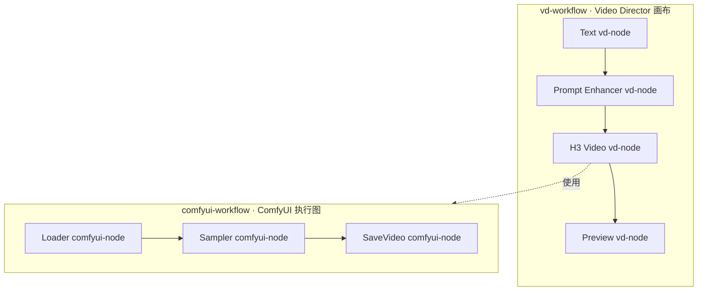

# Video Director 术语约定

[English](TERMINOLOGY.md) · [README](../README.md) · [开发者文档](../skills/canvas-adviser/references/usage.md)

本文统一文档、设计讨论、Agent 指令与新增界面文案的术语。`vd-` 表示 Video Director，`comfyui-` 表示 ComfyUI 层。中英文均保留小写、连字符拼写；英文复数写作 `vd-nodes` 等。

## 两层图结构

| 术语 | 含义 |
|---|---|
| **vd-node** | Video Director 画布中的一个节点实例，包括输入、生成、工具、Preview 和 Save Output。调用 ComfyUI 的 vd-node 仍然是 vd-node。 |
| **comfyui-node** | ComfyUI 图中的一个节点。API 格式中包含图内 ID、`class_type` 与 `inputs`；内置类和自定义类的实例都属于 comfyui-node。 |
| **vd-workflow** | 由 vd-node 及其连线组成的 Video Director 编排图。**vd-graph** 是强调结构时的同义词，**canvas（画布）** 指编辑器视图。整体制作流程默认称为 vd-workflow。 |
| **comfyui-workflow** | 交给 ComfyUI 的图，作为调用 ComfyUI 的 vd-node 的实现。可执行图称为 **API 格式 comfyui-workflow**；含布局、`nodes` 和 `links` 的 UI JSON 称为 **ComfyUI 编辑器模板**。 |
| **registered comfyui-workflow（已注册 comfyui-workflow）** | Video Director 的 **ComfyUI workflow registry（ComfyUI 工作流注册表）** 中通过 `workflowId` 选择的命名条目，包含 API 图、默认值、绑定和开放参数。它与容纳该 vd-node 的 vd-workflow 不同。 |

一个 vd-workflow 可以包含多个调用 ComfyUI 的 vd-node，每个 vd-node 使用的 comfyui-workflow 又可包含多个 comfyui-node。其他 vd-node 可以调用 Ollama、OpenAI-compatible API、Codex Plan，或执行本地行为。

“Workflow 节点”有歧义，应写作**生成 vd-node**、具体名称如 **H3 Video vd-node**，或 **ComfyUI-backed vd-node（调用 ComfyUI 的 vd-node）**。尤其不能把最后一种简称为 comfyui-node。

## 定义、包与连线

| 术语 | 含义 |
|---|---|
| **vd-node definition（vd-node 定义）** | 由类型、精确版本和内容摘要标识的可复用声明。vd-node 实例另有自己的 ID、参数值和连线；多个实例可以使用同一定义。 |
| **vd-node pack** | 包含 manifest 与 implementation 的可移植声明式 `video-director.node/v1` 文档，即原称“Video Director Custom Node v1”的格式。 |
| **ComfyUI custom-node package（ComfyUI 自定义节点扩展包）** | 安装在 ComfyUI 服务端、提供可执行 Python 节点类的扩展。其中某个类的实例称为 **custom comfyui-node**。导入 vd-node pack 不会安装该 Python 扩展。 |
| **comfyui-node class（comfyui-node 类）** | `KSampler` 等 ComfyUI 实现类，由 `class_type` 标识。类名与 comfyui-node 的图内 ID 不同。 |
| **vd-port / vd-edge** | vd-node 上的类型化端口 / vd-node 之间的连线。**handle** 是画布上表示端口的连接控件。 |
| **network port（网络端口）** | `127.0.0.1:8188` 等 Provider 地址中的 TCP 端口，与图端口或 Handle 无关。 |
| **comfyui-input / comfyui-output slot / comfyui-link** | comfyui-workflow 内部的输入、按序号索引的输出或连线。API 连线 `["12", 0]` 引用 comfyui-node ID 与输出槽位。 |
| **vd-field / workflow parameter** | vd-node 的可配置字段；workflow parameter 专指已注册 comfyui-workflow 开放的控件。字段只有启用参数输入模式后才成为 vd-port，动态端口 ID 为 `field:<fieldId>`。 |
| **workflow binding（工作流绑定）** | 将 vd-field、vd-port、运行时值或字面量映射到精确 comfyui-node 输入的规则。它跨越两层图结构，与 vd-edge 和 comfyui-link 不同。 |

本仓库的 [`custom_nodes/`](../custom_nodes/README.md) 保存 Video Director JSON 文档。`*.node.json` 是带 `nodeData` 的内置/旧格式工作流文档；`*.manifest.json` 示例是 v1 vd-node pack。这里与 ComfyUI 安装目录中存放 Python 扩展的 `custom_nodes/` 不同。讨论路径时必须说明所属项目。

## 执行与其他易混术语

| 推荐术语 | 区别 |
|---|---|
| **vd-run / vd-job / ComfyUI submission** | vd-run 编排 vd-workflow 中选定范围的执行，包含批次重复；vd-job 是一次由 Host 管理的 vd-node 执行记录；ComfyUI submission 是通过 `prompt_id` 跟踪的后端提交。只有使用 ComfyUI 的 Job 才有该提交 ID；本地输入/预览处理不意味着远程 Job 或提交。 |
| **vd-job queue / ComfyUI queue** | Video Director 调度器的待执行任务与 ComfyUI 服务端队列。取消或排查时应说明是哪一个。 |
| **vd-batch / ComfyUI batch parameter** | vd-run 范围的重复执行次数与图内部图像/Latent 的批量参数，二者独立。 |
| **vd-run scheduler / sampling scheduler** | vd-job 的依赖调度与生成图内部的采样/噪声调度。生成参数 `scheduler` 指后者。 |
| **generation prompt / system prompt / ComfyUI prompt payload** | 创作提示文本、模型系统指令与提交给 ComfyUI 的 API 图。ComfyUI `/prompt` 和 `prompt_id` 不表示用户提示文本。 |
| **vd-provider / Canvas chat provider / transport** | vd-node 使用的后端、对话选择的 Provider，以及 REST/MCP 等内部通信路径。即使有多个 Transport 适配器，ComfyUI 仍是一个逻辑 vd-provider。 |
| **model ID 或模型文件名 / workflow ID** | Provider 模型选择或 Loader 权重文件名，与已注册 comfyui-workflow 的标识不同。一个工作流可以加载多个模型。 |
| **vd-project / Canvas session** | 含画布图、设置、Job 记录与素材引用的 Video Project，与通过 `sessionId` 绑定的对话。重新绑定 Session 不会创建新的 vd-project。 |
| **Canvas server / ComfyUI server / host machine** | 运行本插件服务端逻辑的本地 Node.js 进程、ComfyUI 服务与承载服务的机器。**vd-node host** 指 Canvas server 内的 `DirectorNodeHost` 接口。 |
| **vd-asset / provider output** | 不可变的工程所属媒体与导入前的后端文件/返回结果。文字结果不一定是 Asset。**Project Save** 保存画布编辑；**Save Output vd-node** 命名产物并提供浏览器下载。 |

## 源码命名

Video Director 概念使用 `Vd*` / `vd*`，ComfyUI 图与注册表条目使用 `ComfyWorkflow*` / `comfyWorkflow*`。已有 `DirectorNode`、`DirectorGraph` 和 `DirectorJob` 已明确属于 Video Director，继续保留。模块和图结构边界的命名需要明确归属；作用域清晰的函数内局部变量可保持简短。

| 概念 | 推荐源码名称 | 兼容别名 |
|---|---|---|
| ComfyUI 注册表 | `ComfyWorkflowStore`、`extractComfyWorkflowInterface` | `WorkflowStore`、`extractWorkflowInterface` |
| ComfyUI 图控件 | `ComfyWorkflowKind`、`ComfyWorkflowBinding`、`ComfyWorkflowParameter`、`ComfyWorkflowDescriptor` | 对应的 `Workflow*` 名称 |
| vd-node 声明 | `VdNodeRegistry`、`normalizeVdNodePack`、`VD_NODE_PROTOCOL` | `NodeRegistry`、`normalizeNodePack`、`NODE_PROTOCOL` |
| vd-node 接口 | `VdNodeDefinitionDescriptor`、`VdPortDescriptor`、`VdFieldDescriptor` | `NodeDefinitionDescriptor`、`NodePortDescriptor`、`NodeFieldDescriptor` |
| vd-run | `VdRun`、`VdRunMode`、`VdRunPlan`、`planVdRun` | `DirectorWorkflowRun`、`WorkflowRunMode`、`WorkflowRunPlan`、`planWorkflowRun` |
| vd-node 执行 | `VdNodeResult`、`isExecutableVdNodeKind` | `WorkflowResult`、`isExecutableWorkflowKind` |
| 画布执行方法 | `runVdWorkflow`、`cancelVdRun` | `runWorkflow`、`cancelWorkflowRun` |

内部调用点使用推荐名称，原有导出通过标记弃用的别名兼容已有使用方。历史文件名也保持稳定：[`workflow-store.js`](../src/workflow-store.js) 管理 ComfyUI 注册表，[`node-registry.js`](../src/node-registry.js) 管理 vd-node 定义，[`workflow-runner.ts`](../src/client/workflow-runner.ts) 规划 vd-run。共享[类型定义](../src/client/types.ts) 注明易混序列化字段的归属。

## 现有标识符与界面标签

协议字符串、RPC 端点、文件名、外部类名、序列化键与保存的 ID 必须保持精确。源码符号重命名不改变 `workflowId`、`workflowRunId`、`nodeId`、`video-director.node/v1` 或持久化 Renderer Key `director`。

**Node.js** 和 `node` CLI 指 JavaScript 运行时，不是图元素；同样保留其原名。

| 现有写法 | 实际含义 |
|---|---|
| `DirectorNode`、`project.graph.nodes[].id`、Job `nodeId` | vd-node 实例或实例 ID |
| `nodeType`、`nodeVersion`、`nodeDigest`、`NodeRegistry` | vd-node 定义标识或注册表 |
| `DirectorGraph`、`project.graph` | vd-workflow / vd-graph |
| `WorkflowStore`、`WorkflowDescriptor`、`workflowId`、`workflows.json` | ComfyUI 工作流注册表或其中条目 |
| `nodeData.workflow`、`implementation.workflow`、`comfyui.workflow` | 内嵌 comfyui-workflow 或其实现类型 |
| 旧格式 `bindings[].nodeId`、v1 `bindings[].target.nodeId`、参数 `nodeId` | 目标 comfyui-node ID，不是画布 vd-node ID |
| `DirectorWorkflowRun.id`、Job `workflowRunId` | vd-run ID |
| `DirectorJob.id`、`jobId` | vd-job ID |
| `clientRunId` | 一次 vd-node 执行请求的客户端关联 ID，与分组 vd-run ID 不同 |
| ComfyUI `prompt_id`、Job/Result `promptId` | ComfyUI submission ID |
| 调用 ComfyUI 的 vd-node 内的 **Workflow** 选择器 | 已注册 comfyui-workflow 选择 |
| **TEXT WORKFLOW**、**IMAGE WORKFLOW**、**Audio Workflow** | 现有生成 vd-node 的标题或控件，不是整个 vd-workflow 的名称 |
| **Custom Node**、**Nodes & Workflows** | 涉及 vd-node 定义和 ComfyUI 工作流注册表的现有 UI 标签；说明操作时补充所属层 |

新增文案优先使用明确术语。操作说明仍引用当前真实标签，例如“在 **Nodes & Workflows** 中导入 vd-node pack”。**Text**、**H3 Video** 和 **Preview** 等描述性标题可以保持简短；说明其所属层时加上限定词。

评审和问题报告应同时写明归属与标识符，例如：“vd-node `v7` 的 vd-job `j1` 在绑定已注册 comfyui-workflow `w3` 中 comfyui-node `12` 的 `seed` 输入时失败。”跨层描述避免单独使用“节点”“工作流”“运行”或“ID”。
